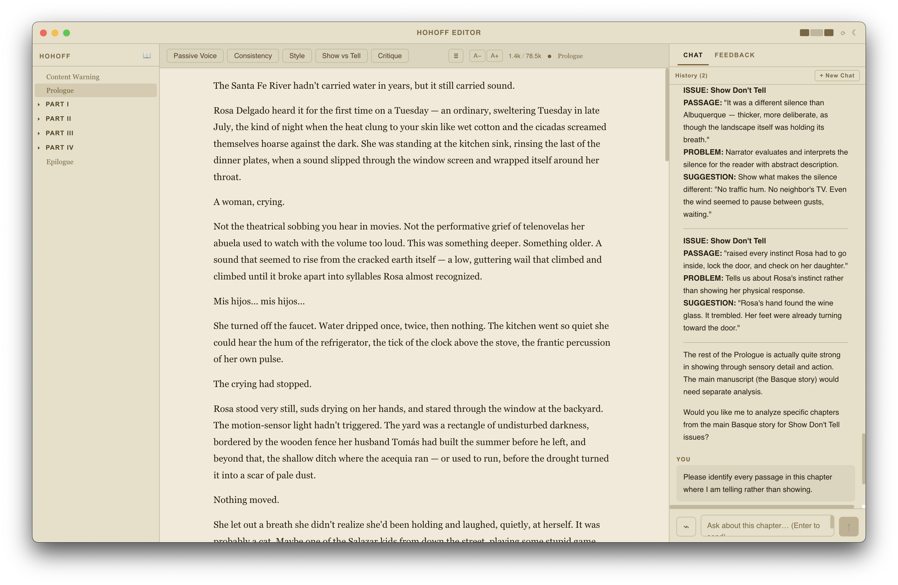
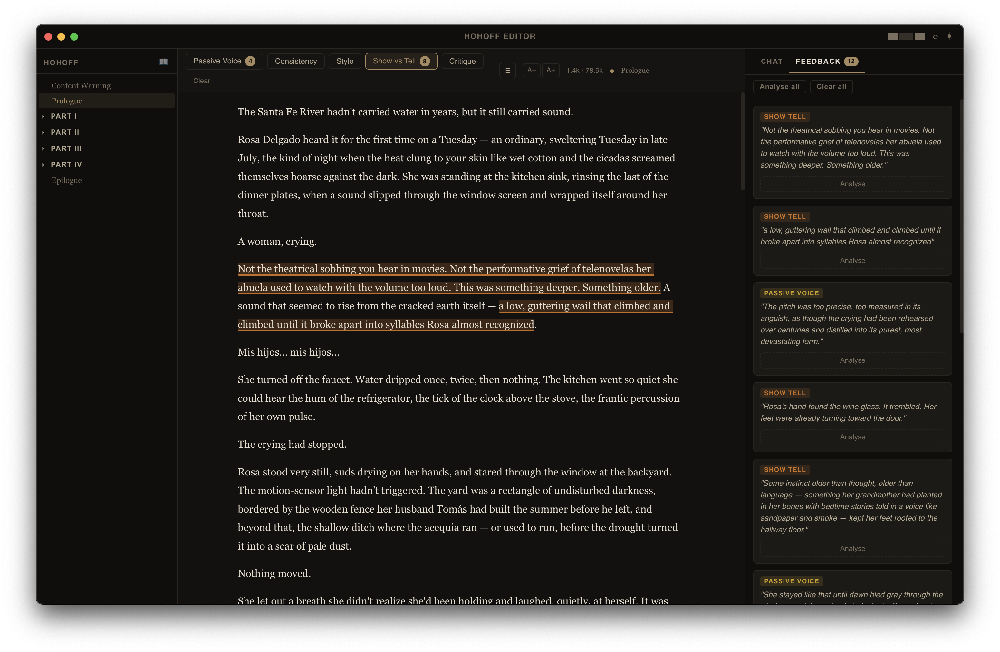

<p align="center">
  
</p>

# Hohoff Editor

A desktop manuscript editor built for the revision stage of novel writing. After producing a first draft in Scrivener or another writing tool, bring your manuscript here to strengthen it before it goes to a human editor.

Hohoff is not a substitute for professional editing. It is a preparation tool: it helps writers identify weaknesses in their own prose — passive voice, consistency gaps, show-vs-tell moments, pacing — so the manuscript arrives at the editor's desk in better shape. The AI flags candidates for revision; you decide what to change and how.

Built with Electron, React, and Claude (Anthropic).

<p align="center">
  
  
</p>

---

## Features

### Manuscript editor
- Markdown editor (CodeMirror 6) with syntax highlighting
- Document outline navigation by heading level
- Full-text search across all draft files
- Drag-and-drop file reordering

### AI revision tools
All AI features are diagnostic, not generative — they identify candidates for revision, they don't rewrite your work.

**Inline annotations** — Run an analysis pass on the open chapter and the editor marks specific passages inline:
- Passive voice
- Consistency (character names, details, continuity)
- Style
- Show vs. tell
- General critique

Hover an annotation to see the suggestion. Apply or dismiss with one click; apply is undoable.

**Chat** — Ask questions about the open chapter. The AI has access to the chapter text as context. Two optional context toggles extend what it can see:

- **Story bible** — Injects your `Story Bible.md` reference file. Useful for continuity questions.
- **Whole story** — Injects the entire manuscript in narrative order. Useful for arc-level questions.

Both modes surface revision opportunities; the AI doesn't produce prose for you to paste in.

### Story Bible
`Story Bible.md` lives in your project folder alongside the manuscript. Edit it directly in the app. A generation tool can bootstrap it from your existing manuscript (characters, world-building, timeline, themes, continuity rules) as a starting point.

### Revision history
Every save creates a versioned snapshot in `.hohoff/.revisions/`. The revisions panel shows word count per version and lets you browse history.

### File management
- Create, rename, and delete files via right-click context menu
- Custom ordering persisted in `.hohoff/.order.json`
- Folder structure mirrors Part I–IV chapter organisation

---

## Requirements

- macOS (primary target)
- Node.js 18+
- An [Anthropic API key](https://console.anthropic.com/)

---

## Setup

```bash
git clone <repo>
cd hohoff/app
npm install
```

On first launch, open **Hohoff → Preferences** (or `Cmd+,`) and set:
- **API key** — your Anthropic key
- **Project path** — the folder containing your manuscript files

Configuration is stored in `~/.hohoff/config.json`.

---

## Development

```bash
cd app
npm run dev        # Electron dev server with hot reload
npm run build      # Production build
npm run typecheck  # Type-check (Node + browser configs)
```

---

## Project structure

```
hohoff/
├── app/                    Electron application
│   └── src/
│       ├── main/           Node process: file I/O, AI calls, IPC handlers
│       ├── preload/        contextBridge (renderer ↔ main)
│       └── renderer/       React UI (editor, chat, file tree, panels)
└── draft/                  Manuscript files (Markdown)
    ├── Prologue.md
    ├── Part I/
    │   └── *.md
    ├── Part II/ … Part IV/
    ├── Epilogue.md
    └── .hohoff/            App metadata (not manuscript content)
        ├── .order.json     Custom file ordering
        ├── .session.json   Persisted app state
        ├── .revisions/     Version history
        └── Story Bible.md  Reference file (optional)
```

---

## Configuration reference

`~/.hohoff/config.json`:

```json
{
  "apiKey": "sk-ant-...",
  "projectPath": "/path/to/your/draft"
}
```

Changes to `apiKey` take effect immediately. Changes to `projectPath` require a restart.
